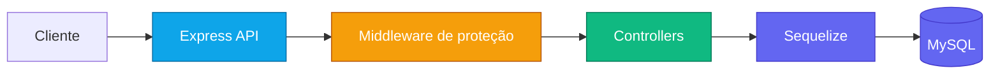

# Fiscalize-API-V1

<p align="center">
	
	
	
	
</p>

<p align="center">
	API backend em Node.js para controle financeiro, com autenticação JWT, persistência em MySQL via Sequelize e proteção contra abuso de requisições com rate limit e slow down.
</p>

<p align="center">
	
</p>

<table>
	<tr>
		<td><strong>Status</strong></td>
		<td>API pronta para uso com banco relacional e autenticação</td>
	</tr>
	<tr>
		<td><strong>Foco</strong></td>
		<td>Usuários, bancos, tipos de pagamento e despesas extras</td>
	</tr>
	<tr>
		<td><strong>Proteção</strong></td>
		<td>JWT, rate limit e slow down</td>
	</tr>
</table>

## Funcionalidades

- Cadastro, login e gerenciamento de usuários.
- Controle de bancos cadastrados pelo usuário.
- Controle de tipos de pagamento.
- Registro, listagem, edição e exclusão de despesas extras.
- Autenticação com token JWT.
- Sincronização automática do banco de dados ao iniciar a aplicação.
- Limitação e desaceleração de requisições para reduzir abuso.

## Visão Geral



## Tecnologias

| Camada | Ferramenta |
| --- | --- |
| Runtime | Node.js |
| API | Express |
| ORM | Sequelize |
| Banco | MySQL |
| Autenticação | JWT |
| Segurança | bcryptjs, rate limit, slow down |
| Utilitários | cors, dotenv, moment, uuid |

## Pré-requisitos

- Node.js 18+.
- MySQL em execução.
- Um arquivo `.env` configurado na raiz do projeto.

> Dica: se estiver usando Docker ou um ambiente local com múltiplos serviços, garanta que o banco esteja acessível antes de iniciar a API.

## Instalação

1. Instale as dependências:

```bash
npm install
```

2. Configure o arquivo `.env` com as variáveis necessárias.

## Variáveis de ambiente

O projeto utiliza as seguintes variáveis:

- `PORT`: porta em que a API será executada.
- `MYSQLUSER`: usuário do MySQL.
- `MYSQLPASSWORD`: senha do MySQL.
- `MYSQLDATABASE`: nome do banco de dados.
- `MYSQLHOST`: host do banco de dados.
- `MYSQLPORT`: porta do MySQL.
- `DB_DIALECT`: dialect do Sequelize, normalmente `mysql`.
- `JWT_SECRET`: segredo usado para assinar os tokens JWT.
- `MAX_LOGIN_ATTEMPTS`: número máximo de tentativas de login antes do bloqueio.
- `ROOT_SYSTEM`: identificador do usuário root do sistema.

Exemplo de `.env`:

```env
PORT=3000
MYSQLUSER=root
MYSQLPASSWORD=sua_senha
MYSQLDATABASE=fiscalize_financas
MYSQLHOST=localhost
MYSQLPORT=3306
DB_DIALECT=mysql
JWT_SECRET=uma_chave_forte
MAX_LOGIN_ATTEMPTS=5
ROOT_SYSTEM=SEU_ID_ROOT
```

## Scripts

| Script | Descrição |
| --- | --- |
| `npm start` | Inicia a aplicação com `node server.js`. |
| `npm run dev` | Inicia a aplicação com `nodemon`. |
| `npm test` | Executa os testes com Jest. |

## Execução

Para rodar em desenvolvimento:

```bash
npm run dev
```

Para rodar em modo normal:

```bash
npm start
```

Ao iniciar, a API realiza a autenticação com o banco e executa `sequelize.sync({ force: false })` para garantir a existência das tabelas.

## Fluxo de uso

1. Configure o `.env`.
2. Instale as dependências.
3. Suba o MySQL.
4. Inicie a API.
5. Faça login e use o token nas rotas protegidas.

## Rotas da API

A API expõe os seguintes grupos de rotas:

### Resumo Rápido

| Módulo | Base |
| --- | --- |
| Usuários | `/api/users` |
| Bancos | `/api/banks` |
| Tipos de pagamento | `/api/type-payments` |
| Despesas extras | `/api/extra-purchase` |

### Usuários

Base: `/api/users`

- `POST /login`
- `POST /register`
- `GET /list-users` `auth`
- `GET /:id` `auth`
- `PUT /update/:id` `auth`
- `DELETE /delete/:id` `auth`
- `PUT /new-admin` `auth`
- `PUT /inative-user` `auth`
- `POST /send-code`
- `POST /reset-password`

### Bancos

Base: `/api/banks`

- `POST /register` `auth`
- `GET /list` `auth`
- `PUT /update/:id` `auth`
- `DELETE /delete/:id` `auth`

### Tipos de pagamento

Base: `/api/type-payments`

- `POST /register` `auth`
- `GET /list` `auth`
- `PUT /update` `auth`
- `DELETE /delete` `auth`

### Despesas extras

Base: `/api/extra-purchase`

- `POST /register` `auth`
- `POST /update` `auth`
- `POST /list` `auth`
- `POST /delete` `auth`
- `GET /:id` `auth`

## Autenticação

As rotas protegidas exigem o cabeçalho:

```http
Authorization: Bearer <seu_token_jwt>
```

## Estrutura do projeto

```text
controllers/        Regras de negócio da API
db/                 Configuração e modelos do Sequelize
middleware/         Middlewares de autenticação e proteção
migrations/         Migrações do banco de dados
routes/             Definição das rotas da API
server.js           Entrada principal da aplicação
```

## Destaques Visuais

- O topo usa badges com cores para destacar as tecnologias principais.
- A seção de visão geral usa um diagrama Mermaid para mostrar o fluxo da API.
- As tabelas melhoram a leitura rápida e deixam o README menos linear.
- O cabeçalho animado reforça a proposta do projeto sem depender de imagens locais.

## Observações

- A API utiliza controle de tentativas de login e bloqueio temporário de conta por segurança.
- O servidor aplica rate limit global e atraso progressivo em excesso de requisições.
- Algumas rotas recebem listas no corpo da requisição para operações em lote.

## Licença

ISC
